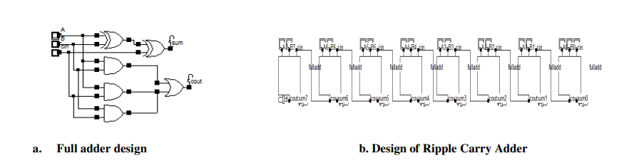
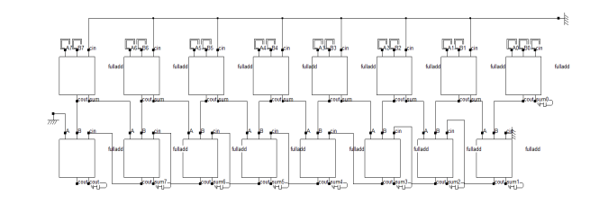
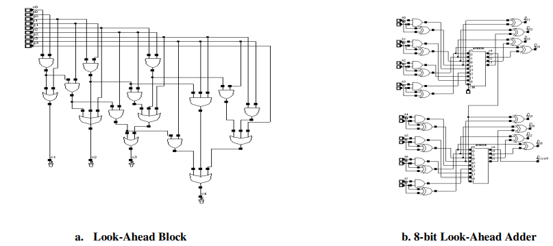
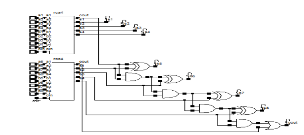
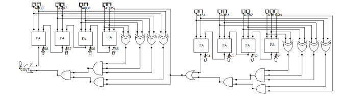
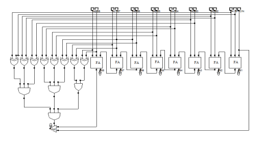
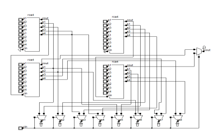
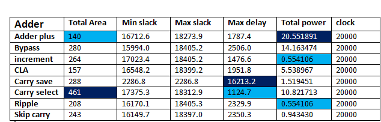
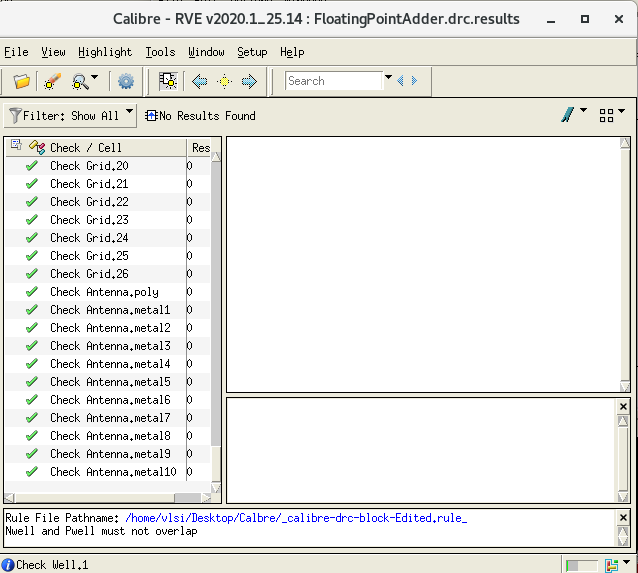
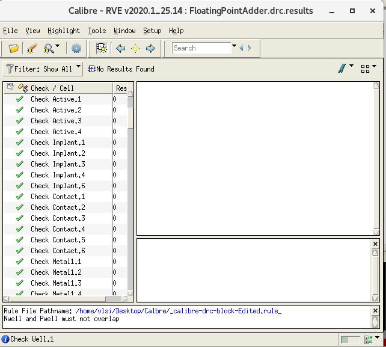

# Verilog-adders-with-synthesis-using-Oasys
Cell-based design techniques, such as standard-cells and FPGAs, together with versatile hardware 
synthesis are rudiments for a high productivity in ASIC design. In the majority of digital signal 
processing (DSP) applications the critical operations are the addition, multiplication and 
accumulation. Addition is an indispensable operation for any digital system, DSP or control 
system. Therefore a fast and accurate operation of a digital system is greatly influenced by 
the performance of the resident adders. Adders are also very significant component in 
digital systems because of their widespread use in other basic digital operations such as 
subtraction, multiplication and division. Hence, improving performance of the digital adder 
would extensively advance the execution of binary operations inside a circuit compromised of 
such blocks. Many different adder architectures for speeding up binary addition have been 
studied and proposed over the last decades. For cell-based design techniques they can be well 
characterized with respect to circuit area and speed as well as suitability for logic optimization 
and synthesis. 

This why in this mini project, we will explore different implementations of adders and
study their charachteristics.

In this repo, we implemented using verilog the following 32-bits signed integer adders:

**1- Verilog (‘+’) version of adders**

**2- Ripple Carry Adder**

**3- Carry Save Adder**

**4- Carry Look-Ahead Adder**

**5- Carry Increment adder**

**6- Carry Skip Adder**

**7- Carry Bypass Adder**

**8- Carry Select Adder**

## Ripple Carry Adder (RCA)

The ripple carry adder is constructed by cascading full adders (FA) blocks in series. One full adder is responsible for the addition of two binary digits at any stage of the ripple carry. The carryout of one stage is fed directly to the carry-in of the next stage.

**One of the most serious drawbacks of this adder is that the delay increases linearly with the bit length.**

**The advantages of the RCA are lower power consumption as well as compact layout giving smaller chip area.**

**The design schematic of RCA:**

## Carary Save Adder (CSA)

The carry-save adder reduces the addition of 3 numbers to the addition of 2 numbers. The 
propagation delay is 3 gates regardless of the number of bits. The carry-save unit consists of n full 
adders, each of which computes a single sum and carries bit based solely on the corresponding 
bits of the three input numbers. The entire sum can then be computed by shifting the carry 
sequence left by one place and appending a 0 to the front (most significant bit) of the partial sum 
sequence and adding this sequence with RCA produces the resulting n + 1-bit value.

**The main application of carry save algorithm is, well known for multiplier 
architecture is used for efficient CMOS implementation of much wider variety of algorithms for 
high speed digital signal processing**

**CSA applied in the partial product line of array multipliers will speed up the carry propagation in the array.**

**The design schematic of CSA:**

## Carry Look-Ahead Adder (CLA)

 This adder is based on the principle of looking at the lower order bits of the augends and addend if a higher order carry is generated. This adder reduces the carry delay by 
reducing the number of gates through which a carry signal must propagate. Carry look 
ahead depends on two things: Calculating for each digit position, whether that position is going to 
propagate a carry if one comes in from the right and combining these calculated values to be able 
to deduce quickly whether, for each group of digits, that group is going to propagate a carry that 
comes in from the right. The net effect is that the carries start by propagating slowly through each 
4-bit group, just as in a ripple-carry system, but then moves 4 times faster, leaping from one 
look ahead carry unit to the next. Finally, within each group that receives a carry, the carry 
propagates slowly within the digits in that group

**his adder consists of three stages: a propagate block/ generate block, a sum generator and carry 
generator. The generate block can be realized using the expression** 

 Gi= Ai.Bi  for i=0,1,2,3 Eq (2) 
  
 Similarly the propagate block can be realized using the expression 
  
Pi= Ai⊕Bi   for i=0,1,2,3 Eq (3) 
  
The carry output of the (i-1)th stage is obtained from 
  
 Ci(Cout)= Gi + Pi Ci-1  for i=0,1,2,3 Eq (4) 
  
 The sum output can be obtained using 
  
Si= Ai ⊕ BiCi-1  for i=0,1,2,3 Eq (5) 

**Carry look-ahead adder is designed to overcome the latency introduced by the rippling effect of the carry bits**

**The propagation delay occurred in the parallel adders can be eliminated by carry look ahead adder.**

**The design schematic of 8 bit look ahead adder using two four bit look ahead block:**

## Carry Increment Adder (CIA)

An 8-bit increment adder includes two RCA (Ripple carry adder) of four bit each. The first ripple 
carry adder adds a desired number of first 4-bit inputs generating a plurality of partitioned sum 
and partitioned carry. Now the carry out of the first block RCA is given to CIN of the conditional 
increment block. Thus the first four bit sum is directly taken from the ripple carry output. The 
second RCA block regardless of the first RCA output will carry out the addition operation and 
will give out results which are fed to the conditional increment block. The input CIN to the first 
RCA block is given always low value. The conditional increment block consists of half adders. 
Based on the value of cout of the 1st RCA block, the increment operation will take place. Here 
the half adder in carry increment block performs the increment operation. Hence the output sum 
of the second RCA is taken through the carry increment block.

**The design schematic of Carry Increment Adder:**

## Carry Skip Adder (CSkA)

A carry-skip adder consists of a simple ripple carry-adder with a special speed up carry chain called a skip chain. A carry-skip adder is 
designed to speed up a wide adder by aiding the propagation of a carry bit around a portion of the 
entire adder. Actually the ripple carry adder is faster for small values of N. The crossover point between the 
ripple-carry adder and the carry skip adder is dependent on technology considerations and is 
normally situated 4 to 8 bits. The carry-skip circuitry consists of two logic gates. The AND gate 
accepts the carry-in bit and compares it to the group propagate signal 

**Carry skip adder is a fast adder compared to ripple carry adder when addition of large number of bits take place**

**carry skip adder has O(√n) delay provides a good compromise in terms of delay, along with a simple and regular layout**

**p[i,i+3]=pi+3.pi+2.pi+1   Eq (6)** 

**using the individual propagate values. The output from the AND gate is ORed with cout of RCA 
to produce a stage output of**

**p[i,i+3]=pi+3.pi+2.pi+1   Eq (6)** 
**carry = ci+4 + p[i,i+3].ci Eq (7) 

**If p[i,i+3] =0, then the carry-out of the group is determined by the value of ci+4.**

**However, if 
p[i,i+3]=1 when the carry-in bit is ci =1, then the group carry-in is automatically sent to the next 
group of adders.**

**The design schematic of Carry Skip Adder:**

## Carry Bypass Adder (CByA)

As in a ripple-carry adder, every full adder cell has to wait for the incoming carry before an 
outgoing carry can be generated. This dependency can be eliminated by introducing an additional 
bypass (skip) to speed up the operation of the adder. An incoming carry Ci,0=1 propagates 
through complete adder chain and causes an outgoing carry C0,7=1 under the conditions that all 
propagation signals are 1. When BP = P0P1P3P4P5P6P7P8 = 1, the incoming carry is forwarded 
immediately to the next block through the bypass and if it is not the case, the carry is obtained via 
the normal route. If (P0P1P3P4P5P6P7 = 1) then C0,7 = Ci,0 else either Delete or Generate 
occurred.

**When BP = P0P1P3P4P5P6P7P8 = 1, the incoming carry is forwarded 
immediately to the next block through the bypass and if it is not the case, the carry is obtained via 
the normal route. If (P0P1P3P4P5P6P7 = 1) then C0,7 = Ci,0 else either Delete or Generate 
occurred.**

**The design schematic of Carry Bypass Adder:**

##  Carry Select Adder (CSelA):

A carry-select adder is divided into sectors, each of which – except for the least-significant – 
performs two additions in parallel, one assuming a carry-in of zero, the other a carry-in of one. A 
four bit carry select adder generally consists of two ripple carry adders and a multiplexer.

Adding two n-bit 
numbers with a carry select adder is done with two adders (two ripple carry adders) in order to 
perform the calculation twice, one time with the assumption of the carry being zero and the other 
assuming one. After the two results are calculated, the correct sum, as well as the correct carry, is 
then selected with the multiplexer once the correct carry is known.

**The carry-select adder is simple but rather fast, having a gate level depth of .**

**A carry-select adder speeds 40% to 90%faster than RCA by performing additions in parallel and reducing the maximum carry path.**

**The design schematic of Carry Bypass Adder:**

## Test cases in test bench file:

○ Overflow of positive numbers.

○ Overflow of negative numbers.

○ Addition of positive and negative number

○ Addition of positive and positive number

○ Addition of negative and negative number

○ Additional 3 random testcases.

Testbench prints **“TestCase#i: success”** on success and 
prints the **“TestCase#i: failed with input X and Y and Output Z and overflow
status N”** , X,Y,Z,N in blue should be replaced by your values.

## Synthesis using Oasys:

**Synthesis the adders with the following constraints**

i. Set (virtual) clock to 20ns.

ii. Set Input delay to 1ns.

iii. Set load to 10

iv. Set output load to 0.5ns.

v. Set Utilization to 60%

vi. Enable usage of all library cells.

## Synthesis Results

detailed Synthesis results of each adder are in 'post_synthesis_detailed_reports' folder

**collective results report:**

**Minimum area** : Verilog Adder plus

**Maximum area** : Carry Select Adder

**Minimum delay** : Carry Select Adder

**Maximum delay** : Carry Save Adder

**Minimum Power** : Carry Increment Adder, Ripple Carry Adder

**Maximum Power** : Verilog Adder plus

## Floating point adder design (standard IEEE):

1- Separate mantissas, exponents, signs bits of both inputs

2- In case only one of the inputs is -ve, we transform its mantissa to the 2’s complement form, other wise we use its mantissa directly

3- For input with lower exponent, the mantissa is right shifted to make the 2 exponents have the same value

4- Add both mantissas together using the carry increment adder

5- if the sum is negative, transform it to the 2’s complement form

6- If cout = 1, the result will be right shifted by 1 bit and the exponent will be increased by 1

7- Normalize the result by left shifting the mantissa sum till leading one and subtract number of bits shifted from the exponent

## Adder used in floating point adder

From the synthesis reports, the carry select adder has the lowest propagation delay, below that comes the carry increment with small difference in time but quiet big difference in area and power consumption, so as a combination of both time and power we decided to use the **carry increment adder** in the floating point adder to minimize the delay and power consumption

## How to test the modules?

1-Open Modelsim.

2-Create project

3-Add files in helping_modules folder to the project

4-Add files in verilog_adders_pre_synthesis folder to the project

5-Add file 'Adders_tb.v' & 'floating_adder_tb-1.v' from test_benches folder to the project 

6-Simulate 'Adders_tb.v' file using modelsim to test integer adders

7-Simulate 'floating_adder_tb-1.v' file using modelsim to test floating point adder

## DRC Report of floating point adder:

Results are in 'DRC_Report_Float_Adder' folder

## LVC Report of floating point adder:

Results are in 'LVC_Report_Float_Adder' folder

